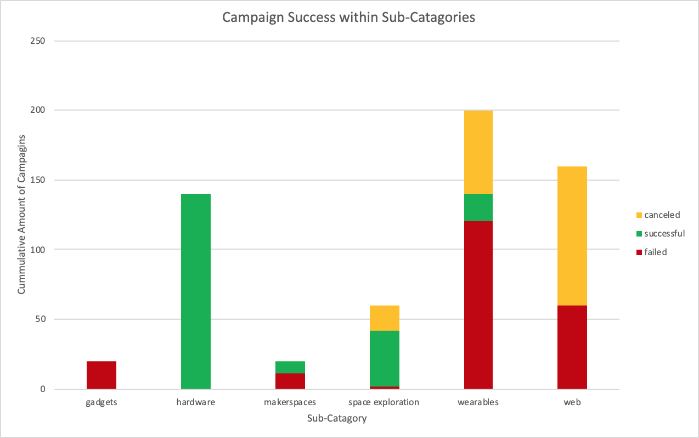
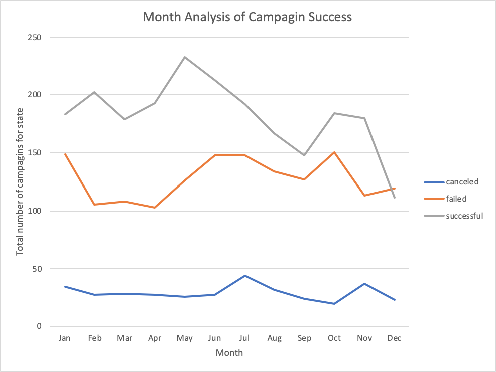
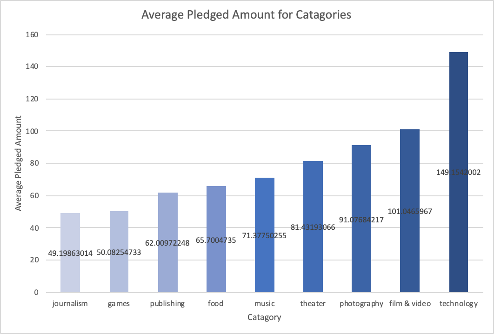
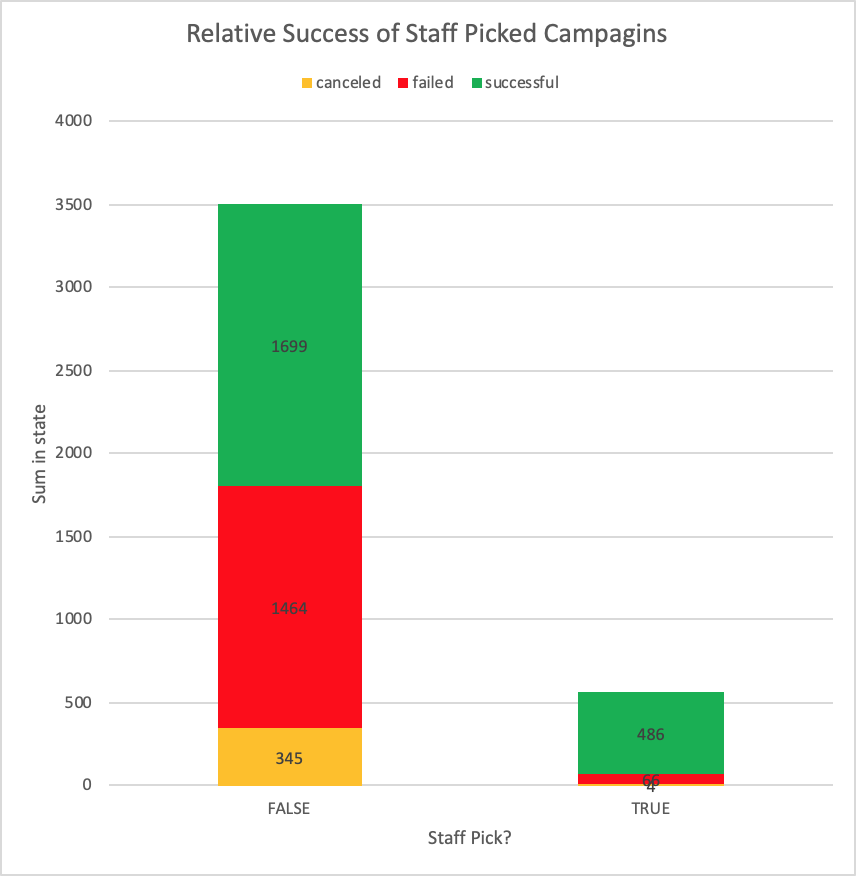

# HW_01 Response

### Conclusions

1. Of the technology based kickstarters, wearables are the most competetive product on the platform, (excluding the 0 successes sub-catagories). Wearables are both the most abundant in this catagory, but also the least successful on average.

   

2. Late-Spring to Midsummer is the most popular time to start a kickstarter, that being said, the amount of failures grow steadily with the number of successes during this period. There is a notacable peak in cancelled projects corresponding to the end of this run. The platform sees another slight growth in usage in November, but a decrease in usage entering the holiday season.

   

3. Food based kickstarters are largely unsuccessful. Since two of the three categories, food trucks and restaurants have never seen a success, It is reasonable to conclude that  users seek tangible rewards for their investments (which would be difficult to provide through traditional restaurants and businesses). Alternatively, the small batch food kickstarters are overwhelmingly successful with 100% reaching their goal. This could be a reflection of the easier access to food product rewards from small batch funding. 

### Limitations

1. Kickstarter pledge rewards are an important factor that determines whether or not users will pledge for products. It would be interesting to study how the distribution of rewards and pricepoints of rewards impact the success of a kickstarter campaign. Similarly, if the distribution of pledge amounts were available, the relationship between pledge distribution and pledge rewards can be studied. 
2. It would be interesting to see how many views a particular campaign received, and through what avenues the view was accumulated (social media, web advertising, etc.). This data is useful for optimizing campaign exposure, and growing the platform overall. This would also allow for a metric of pledges/viewer.

### Extra Charts to Consider

* Average "Average amount pledged" per catagory. Technology likly leads this metric because technology campagins can offer their product as a (large) pledge incentive.

  

* This chart analyzes the performance of campaigns that have been featured on the "Projects We Love" page on kickstarter. This page is curated by kickstarter staff. As expected, projects featured on this page are significantly more successful on average. While non-featured projects have more than a 50% chance of failing, only an eight of featured projects failed.

  

